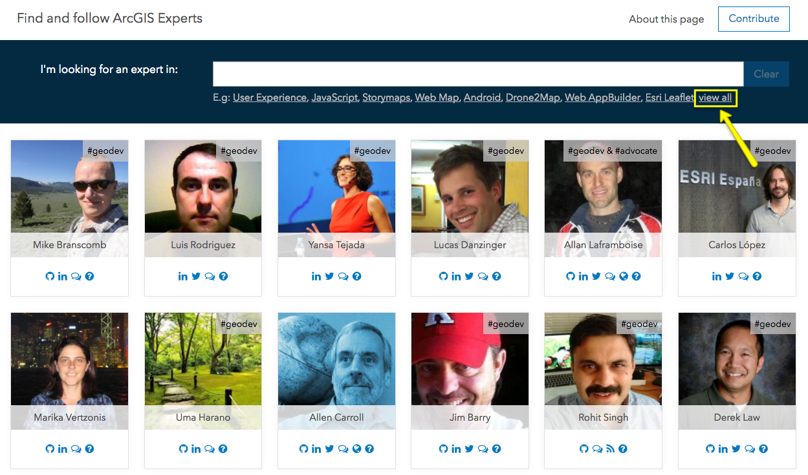

# Contributors

First of all, thanks for been here!, we really appreciate you are considering to help [us](https://github.com/esri-es/arcgis-experts/graphs/contributors).

We have not many rules (yet ;-P), this is a list of topics we consider you can help us, but feel free to suggest anything else you want opening a new issue.

<!-- START doctoc generated TOC please keep comment here to allow auto update -->
<!-- DON'T EDIT THIS SECTION, INSTEAD RE-RUN doctoc TO UPDATE -->
**Table of contents**  

- [Fixing bugs or adding enhancements](#fixing-bugs-or-adding-enhancements)
- [Suggesting new topics](#suggesting-new-topics)
- [Improving the list of experts](#improving-the-list-of-experts)
    - [Add new experts](#add-new-experts)
    - [Update existing profiles](#update-existing-profiles)

<!-- END doctoc generated TOC please keep comment here to allow auto update -->

## Fixing bugs or adding enhancements

There are already a list of [bugs reported and enhancements suggested](https://github.com/esri-es/arcgis-experts/issues) you might want to check.

Let us know inside the issue if you want to work on it so we can assign it to you.

## Suggesting new topics

You can see all the topics available clicking the "view all" link in [the app](https://esri-es.github.io/arcgis-experts/).

This list is a work in progress, so if you miss some topic please [open an issue](issues/new?title=Missing%20topic:%20[TOPIC]&body=I%20would%20like%20to%20see%20experts%20in...) and let us know.

## Improving the list of experts

### Expert profile

This list explains what every property included in the [expert template](https://github.com/esri-es/arcgis-experts/blob/master/ISSUE_TEMPLATE.md):

|Field|Value|Optional|Description|
|---|---|---|---|
|consent|true\|false|False|It means the expert has already accepted to be listed in this directory
|name|string|False|Expert name
|picture|string|False|URL pointing an expert picture
|linkedin|string|True|URL pointing to the expert account (only if it shares content about ArcGIS)
|twitter|string|True|URL pointing to the expert account (only if it shares content about ArcGIS)
|github|string|True|URL pointing to the expert account (only if it shares content about ArcGIS)
|geonet|string|True|URL pointing to the expert account
|arcgisonline|string|True|URL pointing to the expert account
|stackoverflow|string|True|URL pointing to the expert account
|stackexchange|string|True|URL pointing to the expert account
|youtube|string|True|URL pointing to the expert account (only if it shares content about ArcGIS)
|blog|string|True|URL pointing to the expert account (only if it shares content about ArcGIS)
|website|string|True|URL pointing to the expert account (only if it shares content about ArcGIS)
|podcast|string|True|URL pointing to the expert podcast (only if it shares content about ArcGIS)
|geodev|true\|false|False|Does the expert use to write code and feel comfortable talking about that
|advocate|true\|false|False|Is the expert willing to help on GeoNet
|technologies|string|False|Comma separated value of technologies the expert know, share content or can help with

### Add new experts

If you want to suggest a new expert you can directly do a [pull request](https://help.github.com/articles/about-pull-requests/) or if you feel lazy, or do not know how to do that, [open a issue](https://github.com/esri-es/arcgis-experts/issues/new) and fill [this template](./ISSUE_TEMPLATE.md).

> **Note:** having the support of other experts included in this list will help us on the evaluation process, so please let us know if any other expert is supporting this candidate.

### Update existing profiles

**For developers**:

The existing profiles are located in the [experts.json](https://github.com/esri-es/arcgis-experts/blob/master/experts.json) file, so if you want, you can also update any existing profile doing a [pull request](https://help.github.com/articles/about-pull-requests/) or using the [online editor](https://help.github.com/articles/editing-files-in-your-repository/).

**For non-developers**:

In case you don't know how to do a pull request, [open the app](https://esri-es.github.io/arcgis-experts/), find the profile (*use Ctrl+F*), click the question mark icon and then click the "**please tell us**" link just above the "**Done**" button.
